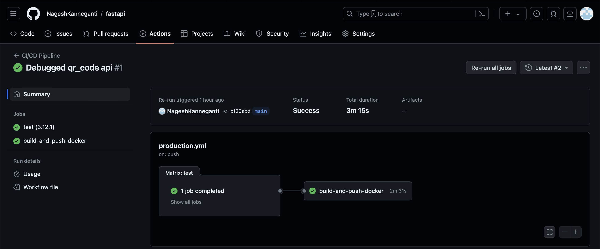

# Homework 9: Debugging QR Code API

# Debugging Changes

1. *app/main.py*
> Ln [36](https://github.com/NageshKanneganti/fastapi/blob/bf00abd09613085cdf187f94889411923465ccc3/app/main.py#L36)
```python
app.include_router(qr_code.router) # Fixed typo: ruter -> router
```

2. *app/routers/oauth.py*
> Ln [18](https://github.com/NageshKanneganti/fastapi/blob/bf00abd09613085cdf187f94889411923465ccc3/app/routers/oauth.py#L18)
```python
@router.post("/token", response_model=Token) # Fixed typo: /tokn -> /token
```

3. *app/routers/qr_code.py*
> Ln [24](https://github.com/NageshKanneganti/fastapi/blob/bf00abd09613085cdf187f94889411923465ccc3/app/routers/qr_code.py#L24C1-L24C109)
```python
@router.post("/qr-codes/", response_model=QRCodeResponse, status_code=status.HTTP_201_CREATED, tags=["QR Codes"]) # Updated status code from HTTP_200_OK to HTTP_201_CREATED to accurately reflect the creation of a new resource (QR code) as per HTTP standards.
```
<br>

> Ln [45](https://github.com/NageshKanneganti/fastapi/blob/bf00abd09613085cdf187f94889411923465ccc3/app/routers/qr_code.py#L45)
```python
status_code=status.HTTP_409_CONFLICT, # Updated status_code from HTTP_200_OK to HTTP_409_CONFLICT to more accurately reflect the situation where a duplicate QR code creation request is made, indicating a conflict with the current state of the resources.
```
<br>

> Ln [69](https://github.com/NageshKanneganti/fastapi/blob/bf00abd09613085cdf187f94889411923465ccc3/app/routers/qr_code.py#L69)
```python
@router.delete("/qr-codes/{qr_filename}", status_code=status.HTTP_204_NO_CONTENT, tags=["QR Codes"]) # Fixed typo: qr_fileame -> qr_filename; Updated status_code from HTTP_200_OK to HTTP_204_NO_CONFLICT to accurately reflect that the resource has been successfully deleted without any content to return in the response.
```

4. *app/services/qr_service.py*
> Ln [49](https://github.com/NageshKanneganti/fastapi/blob/bf00abd09613085cdf187f94889411923465ccc3/app/services/qr_service.py#L49)
```python
def delete_qr_code(file_path: Path): # Fixed typo: delete_qr_cde -> delete_qr_code
```

5. *app/utlis/common.py*
> Ln [69](https://github.com/NageshKanneganti/fastapi/blob/bf00abd09613085cdf187f94889411923465ccc3/app/utils/common.py#L69)
```python
sanitized_url = validate_and_sanitize_url(str(url)) # Fixed typo: sanitizd_url -> sanitized_url
```
<br>

> Ln [84](https://github.com/NageshKanneganti/fastapi/blob/bf00abd09613085cdf187f94889411923465ccc3/app/utils/common.py#L84)
```python
decoded_bytes = base64.urlsafe_b64decode(encoded_str) # Corrected typo in the function call from '...b6decode...' to '...b64decode...' to ensure proper base64 URL-safe decoding. This step converts the base64-url-encoded string back to its original URL format.
```

6. *app/config.py*
> Ln [44](https://github.com/NageshKanneganti/fastapi/blob/bf00abd09613085cdf187f94889411923465ccc3/app/config.py#L44)
```python
ADMIN_PASSWORD = os.getenv('ADMIN_PASSWORD', 'secret') # Fixed typo: 'ecret' -> 'secret'
```

7. *app/schema.py*
> Ln [5](https://github.com/NageshKanneganti/fastapi/blob/bf00abd09613085cdf187f94889411923465ccc3/app/schema.py#L5)
```python
url: HttpUrl = Field(..., description="The URL to encode into the QR code.") # Corrected the parameter name typo from 'ul' to 'url' to accurately reflect its purpose as the URL to be encoded into the QR code.
```
<br>

> Ln [37](https://github.com/NageshKanneganti/fastapi/blob/bf00abd09613085cdf187f94889411923465ccc3/app/schema.py#L37)
```python
message: str = Field(..., description="A message related to the QR code request.") # Fixed typo: 'mssage' -> 'message'
```

# Production Changes
1. *production.yml* - Replaced professors dockerhub repo with my own
> Lns [57-73](https://github.com/NageshKanneganti/fastapi/blob/bf00abd09613085cdf187f94889411923465ccc3/.github/workflows/production.yml#L57-L73)
```
tags: nagkann/fastapi:${{ github.sha }} # Uses the Git SHA for tagging
cache-from: type=registry,ref=nagkann/fastapi:cache
image-ref: 'nagkann/fastapi:${{ github.sha }}'
```
<br>

2. *docker-compose.yml* - Added line 6 to build the image for my FastAPI application and tag it as __nagkann/fastapi__ when I run the `docker compose up --build` command.
> Ln [6](https://github.com/NageshKanneganti/fastapi/blob/bf00abd09613085cdf187f94889411923465ccc3/docker-compose.yml#L6)
```
image: nagkann/fastapi
```

# Screenshots
> Docker

<br>

> GitHub Actions
